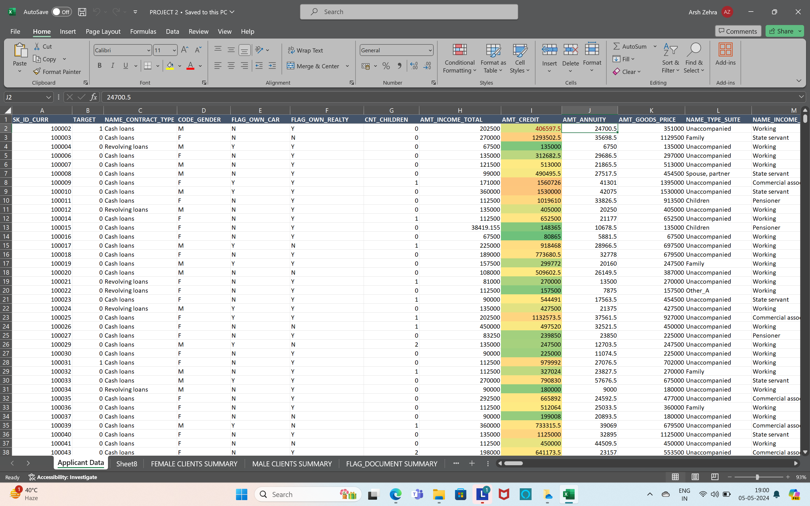
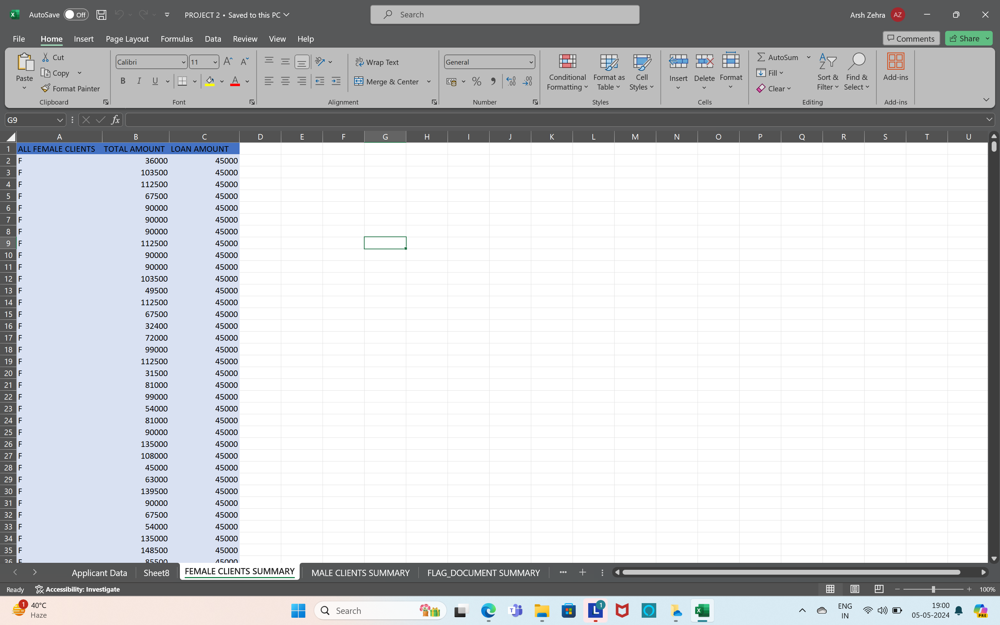
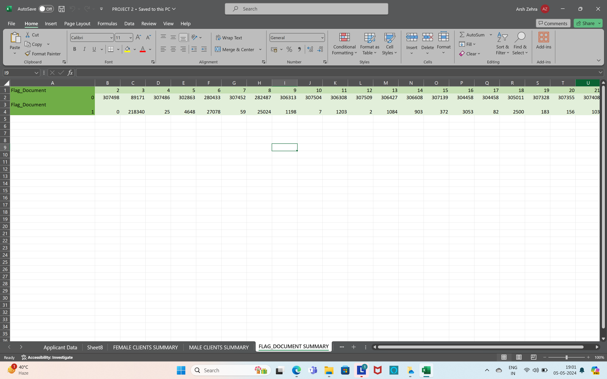
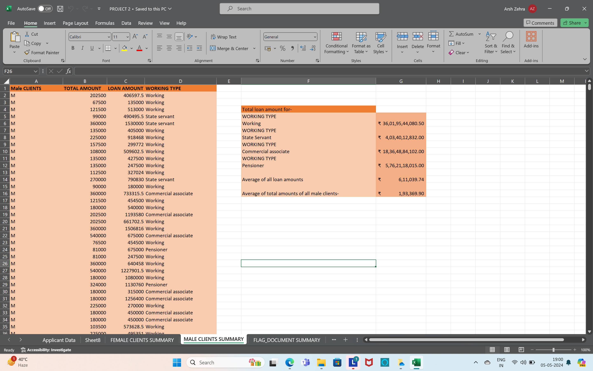
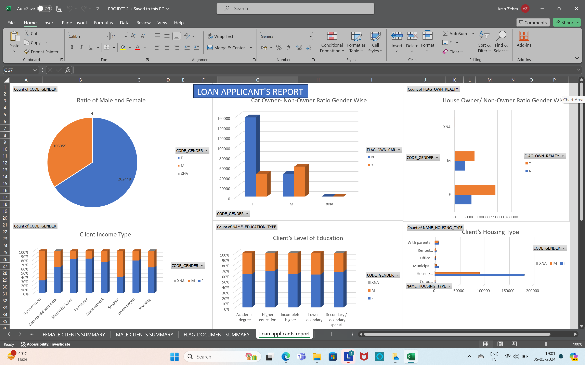

# LoanApplicant-sdata-Excel

.png)

## Introduction
You are working as Business Analyst in IJS Bank Limited. Currently your organization is working on Loan Applicant Clients for the current quarter. The Manager of the Branch asked you to analyze Loan Applicant’s data and to Present appropriate report on the shared data. The report should be demonstrated using Dashboard into MS Excel.
## Features of Dashboard - 
create pivot charts for all below mentioned questions & make an attractive dashboard out of it.
Gender Ratio of Applicants
Car Owner/ Non-Owner Ratio
House Owner/ Non-Owner Ratio
Client Income Type
Client’s Level of Education
Client’s Housing Type
Client’s Family Status
Client’s Occupation Type
## Separate Worksheet Required for
Data Summary of All Female Client’s for Income and Loan Amount using New Functions (hint: use unique,sort,filter functions) if These functions are not supporting in your software please give a theoritical answer.
Data Summary of All male Client’s for Income and Loan Amount using list Functions (hint:use dsum,daverage,..)
Data Summary for all Flag Columns like (FLAG_DOCUMENT_2, FLAG_DOCUMENT_3 etc.) using all variants of DCOUNT function.
## Other Deliverables
Create a macro for conditional formatting & freezing panes
## Contact Information
For inquiries or support regarding this project, please contact Arsh Zehra at zehrarsh@gmail.com.
